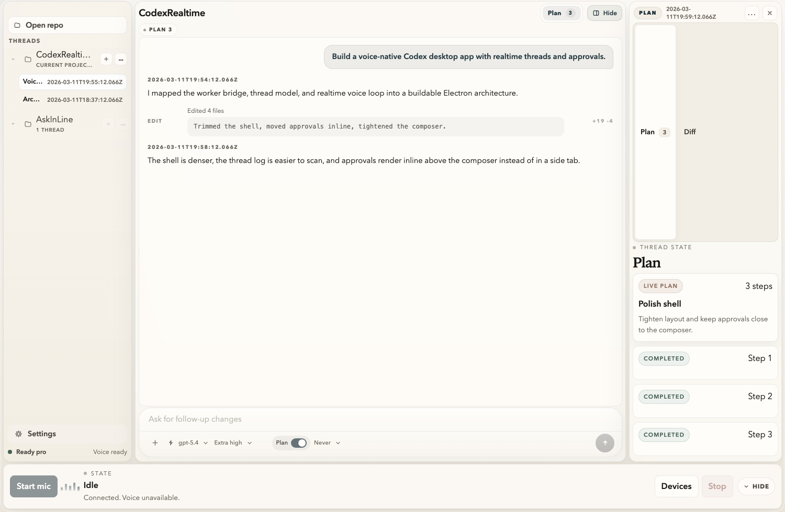
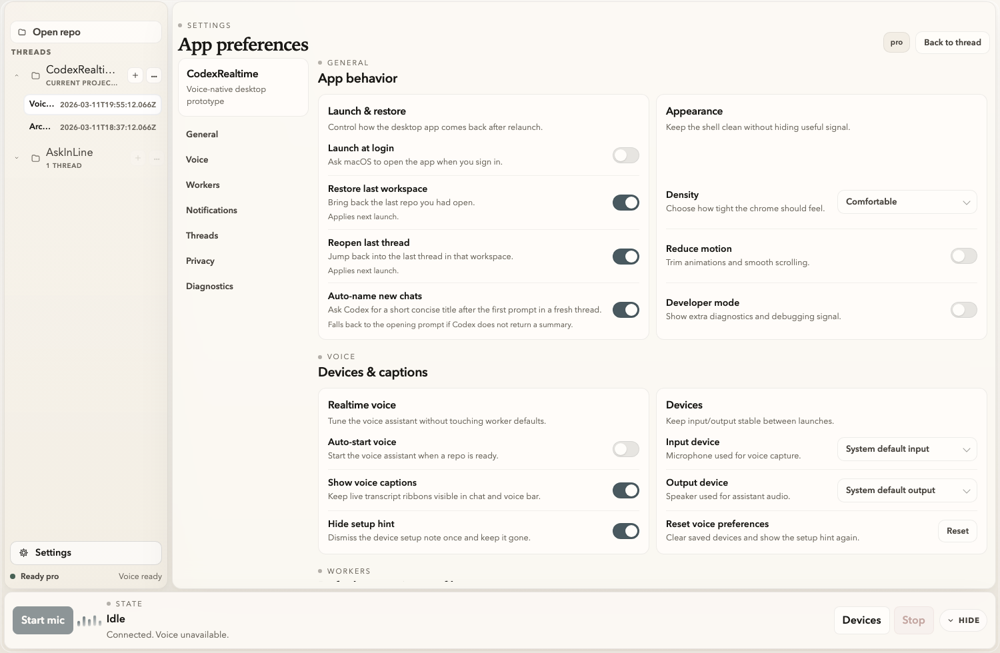

# CodexRealtime

Voice-native Codex desktop prototype.

[](https://github.com/net-snix/CodexRealtime)
[](https://github.com/net-snix/CodexRealtime)
[](https://www.electronjs.org/)
[](https://react.dev/)
[](https://www.typescriptlang.org/)

Electron app. React renderer. Local Codex app-server bridge. Realtime voice loop. Workspace threads, approvals, settings, archives, worker controls.

## Status

Working local prototype.

Current surface:

- workspace + thread navigation
- live timeline + worker activity
- inline approvals + clarification
- voice bar + device selection
- settings page + archived chats
- worker model / reasoning / plan / approval controls
- Electron E2E regression coverage

## Screenshots

| Thread workspace | Settings |
| --- | --- |
|  |  |

## Stack

- Electron
- React
- TypeScript
- electron-vite
- pnpm
- Vitest
- Playwright

## Run

```bash
pnpm install
pnpm --filter @codex-realtime/desktop dev
```

## Checks

```bash
pnpm typecheck
pnpm lint
pnpm test
pnpm test:e2e
pnpm build
```

## Repo Notes

- app code: `/apps/desktop`
- shared contracts: `/packages/shared`
- product spec: `/swe-voice-codex-product-spec.md`
